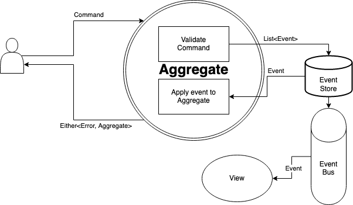

# Bank Account Kata in Kotlin

There is a simple implementation in the simple package and an advanced CQRS / ES version in CQRS package.

This is the schema explaining quickly the ES/CQRS version

When a user send a command, it's sent to the aggregate. The aggregate should be unique in the whole system (even distributed). To that a fully functional system whole need some command bus or router.

The command is validated by the aggregate against business rules which generate a list of events ([process function](https://github.com/ygrenzinger/bank-account-kotlin/blob/master/src/main/kotlin/cqrs/domain/common/Aggregate.kt#L17)). These events are first saved inside the event store to ensure durability and then applied to the aggregate ([apply function](https://github.com/ygrenzinger/bank-account-kotlin/blob/master/src/main/kotlin/cqrs/domain/common/Aggregate.kt#L13)). At the same time, the events are pushed by the event bus to the attached views.

Any way to improve it would be welcomed! :)  
Especially the generics use inside [Aggregate](https://github.com/ygrenzinger/bank-account-kotlin/blob/master/src/main/kotlin/cqrs/domain/common/Aggregate.kt), [View](https://github.com/ygrenzinger/bank-account-kotlin/blob/master/src/main/kotlin/cqrs/domain/common/View.kt) or [EventProcess](https://github.com/ygrenzinger/bank-account-kotlin/blob/master/src/main/kotlin/cqrs/domain/common/EventProcessor.kt)